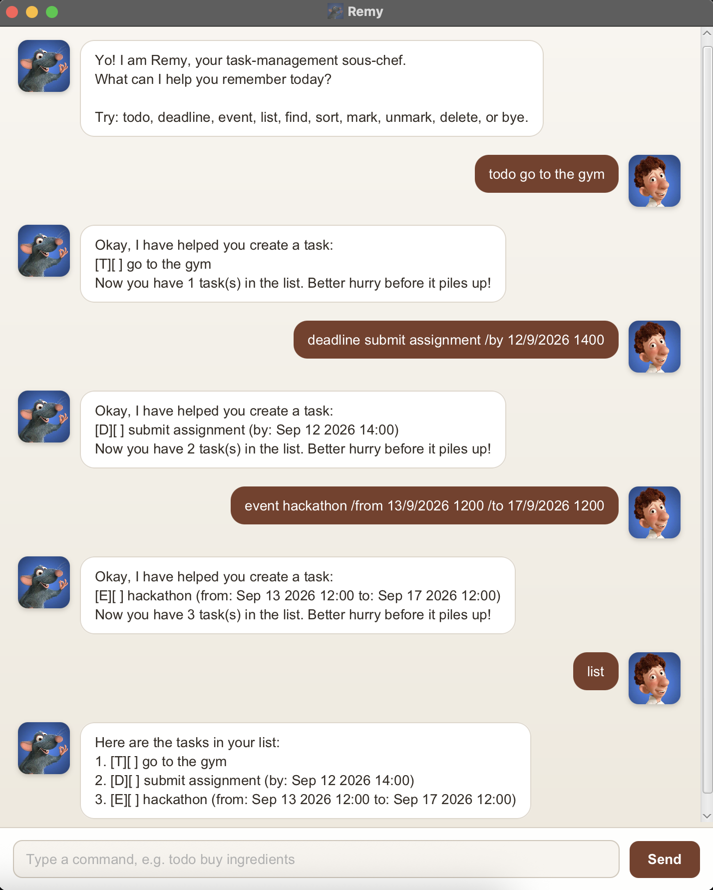

# Remy — Task-Management Chatbot

Remy is a friendly JavaFX chatbot that helps you add, organise, find, and complete tasks using short text commands.
Your task list is saved automatically, so it will still be there the next time you open Remy.



## Quick start

You will need JDK 25.

1. Open a terminal in the project folder.
1. Start Remy:

   ```sh
   ./gradlew run
   ```

   On Windows, use `gradlew.bat run`.

1. Type a command in the box at the bottom of the window, then press <kbd>Enter</kbd> or select **Send**.

Try these commands first:

```text
todo buy ingredients
deadline submit report /by 23/9/2026 1800
list
```

## Command format

- Words in `UPPER_CASE` are values you supply. For example, replace `DESCRIPTION` with `buy ingredients`.
- Items in square brackets are optional. For example, `[/order asc|desc]` may be omitted.
- Command words and parameter labels are lowercase. Use one space between each part, with no leading or trailing
  spaces.
- Follow the parameter order shown in each format and write each parameter only once.
- `NUMBER` is the task number shown by `list` and must be a positive whole number.
- Dates may be written as `23/9/2026`, `2026-09-23`, or `23 Sep 2026`. Add a 24-hour time as `1800`
  or `18:00` when needed.

## Features

### Adding a to-do: `todo`

Adds a task that has no date or time.

Format: `todo DESCRIPTION`

Example: `todo buy ingredients`

### Adding a deadline: `deadline`

Adds a task that must be completed by a date or date and time.

Format: `deadline DESCRIPTION /by DATE`

Examples:

- `deadline submit report /by 23/9/2026`
- `deadline submit report /by 23/9/2026 1800`

### Adding an event: `event`

Adds an activity with a start and an end. Both endpoints must be dates, or both must include times, and the start must
be earlier than the end.

Format: `event DESCRIPTION /from START /to END`

Examples:

- `event camp /from 23/9/2026 /to 25/9/2026`
- `event tutorial /from 23/9/2026 1400 /to 23/9/2026 1500`

### Viewing all tasks: `list`

Shows every task and its number. `[T]`, `[D]`, and `[E]` identify to-dos, deadlines, and events; `[X]` means the task
is done, while `[ ]` means it is not done.

Format: `list`

> **Tip:** Run `list` before using `mark`, `unmark`, or `delete`, then use the number shown in this full list.

### Finding tasks: `find`

Shows tasks whose descriptions contain the given keyword or phrase. Matching is case-insensitive.

Format: `find KEYWORD`

Example: `find report`

The numbers in search results only number those results. Use the number from `list` when changing or deleting a task.

### Sorting tasks by date: `sort`

Sorts dated tasks chronologically and shows the updated list. Deadlines use their due dates, events use their start
dates, and undated to-dos remain at the end.

Format: `sort /by date [/order asc|desc]`

Examples:

- `sort /by date` — earliest first; `asc` is the default
- `sort /by date /order desc` — latest first

The new order and task numbers are saved. Tasks added later go to the end until you sort again.

### Marking tasks done or undone: `mark`, `unmark`

Updates a task's completion status using its number from `list`.

Formats:

- `mark NUMBER`
- `unmark NUMBER`

Examples: `mark 2`, `unmark 2`

### Deleting a task: `delete`

Permanently removes a task using its number from `list`.

Format: `delete NUMBER`

Example: `delete 2`

### Exiting Remy: `bye`

Ends the current chat. Restart Remy to begin another session.

Format: `bye`

## Useful notes

- Task descriptions may contain spaces and punctuation.
- Dates and times must be real; for example, `30/2/2026` and `24:00` are rejected.
- Remy prevents exact duplicate tasks. Tasks may share a description if their type or dates differ.
- Changes are saved as UTF-8 text in `data/remy.txt`; you do not need to save manually.
- If Remy cannot read or write the task file, it reports the affected path and suggests what to check. Unsaved changes
  remain available for the current session but will not survive a restart.

## Building an executable JAR

To package Remy with its dependencies, run:

```sh
./gradlew shadowJar
java -jar build/libs/remy.jar
```

On Windows, replace `./gradlew` with `gradlew.bat`. The resulting JAR requires Java 25.

## Opening the project in IntelliJ IDEA

1. Open this project folder in IntelliJ IDEA and accept the default import settings.
1. Set the project SDK to JDK 25 and the language level to **SDK default**.
1. Run `src/main/java/remy/gui/Launcher.java`.

Keep Java source files under `src/main/java`, which is the source layout expected by Gradle.
